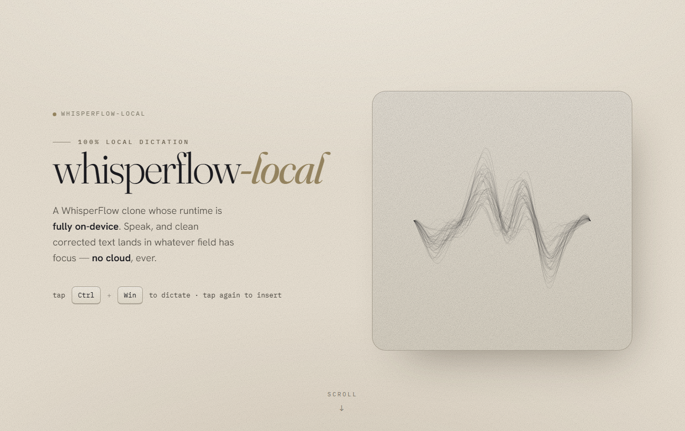

# whisperflow-local

## Build the macOS app

```bash
.venv/bin/python packaging/build_macos.py
```

Build, verify, and install the canonical app into `/Applications`:

```bash
.venv/bin/python packaging/build_macos.py --install
open "/Applications/WhisperFlow Local.app"
```

The wrapper runs Qt deployment, applies the final recursive code signature after
all bundle mutations, and rejects invalid metadata, resources, architecture, or
signatures. Set `WHISPERFLOW_CODESIGN_IDENTITY` to a Developer ID identity for a
distribution build; local builds use an ad-hoc signature.

A 100% local WhisperFlow-style dictation app for macOS Apple Silicon. Tap a
hotkey, speak, and clean corrected text (filler removed, grammar/punctuation
fixed) is inserted into whatever text field has focus. STT and the cleanup LLM
both run on-device at dictation time.



Built as the worked example for a YouTube video whose real deliverable is the
*process*: deep-research -> grill -> cross-model plan review -> Claude Code builds.
See `PLAN.md`, `PLAN-REVIEW-LOG.md`, and `docs/architecture.html` for the original planning history.

## Pipeline

`Cmd+Shift+Space` (toggle) -> mic capture (`sounddevice`, 16 kHz mono) -> STT
(`lightning-whisper-mlx` with `distil-large-v3` on Apple Silicon/Metal) -> cleanup
(Unsloth Studio OpenAI-compatible server, with direct Unsloth CLI fallback) ->
focus-checked clipboard paste with `Cmd+V`. A
non-activating PySide6 pill shows live mic level; a tray icon gives a clean quit.

## Requirements

- macOS on Apple Silicon (`arm64`)
- Python 3.11+ and [`uv`](https://docs.astral.sh/uv/)
- [Unsloth](https://unsloth.ai/) Studio/CLI for the local cleanup model
- macOS Accessibility permission for the terminal/app running whisperflow-local
- Microphone permission for the terminal/app running whisperflow-local

## Local Models

Default STT: `distil-large-v3` through `lightning-whisper-mlx`, `quant: null`.
This is the recommended first choice for local dictation on Mac: it is much faster
than full `large-v3`, keeps good English dictation accuracy, and uses MLX/Metal on Apple Silicon.

Default cleanup: Unsloth Studio serving the cached
`unsloth/Qwen3.5-4B-MTP-GGUF` model as `default` on `http://localhost:8888/v1`.
The app connects to an existing service or starts one locally, captures its generated
key in macOS Keychain, and stops only a process it owns. If the service cannot start,
cleanup falls back to direct Unsloth CLI inference against `Qwen3.5-4B-UD-Q4_K_XL.gguf`. The larger
local `Qwen3.6-35B-A3B-GGUF` cache is not the default because it is too heavy for
fast post-dictation cleanup.

If STT quality is not good enough, switch `stt.model` to `large-v3` and reduce `stt.batch_size` to `6`.

## Setup

```bash
uv venv --python 3.11
uv pip install -e .

python -m whisperflow_local doctor
```

`run` owns the warm local cleanup-service lifecycle. For manual service operation,
`cleanup-server-command` prints the current command and `set-cleanup-key` stores a
generated key in Keychain without writing it to configuration.

`doctor` checks microphone input, the configured STT backend, the selected cleanup
provider plus model, clipboard access, and hotkey/overlay imports. On macOS,
Accessibility and Microphone prompts may appear the first time you run the app.

## Use

```bash
python -m whisperflow_local run                  # live: tap Cmd+Shift+Space
python -m whisperflow_local selftest             # autonomous end-to-end on a sample
python -m whisperflow_local doctor               # environment health check
python -m whisperflow_local cleanup-server-command
python -m whisperflow_local set-cleanup-key
python -m whisperflow_local delete-cleanup-key
python -m whisperflow_local install-autostart    # install a LaunchAgent
python -m whisperflow_local uninstall-autostart  # remove the LaunchAgent
```

Use `Cmd+Shift+Space` to start and stop. Global Enter and Escape controls were
removed because macOS cannot safely suppress them from the focused application.

## Config

`config.yaml` contains bundled defaults. Validated, versioned user overrides live
in `~/Library/Application Support/WhisperFlow Local/settings.json`; secrets live in
Keychain and logs under `~/Library/Logs/WhisperFlow Local`. Logging is metadata-only
by default.

## Status

macOS Apple Silicon is the only active runtime target; non-macOS runtime code and dependencies have been removed from the active package.
