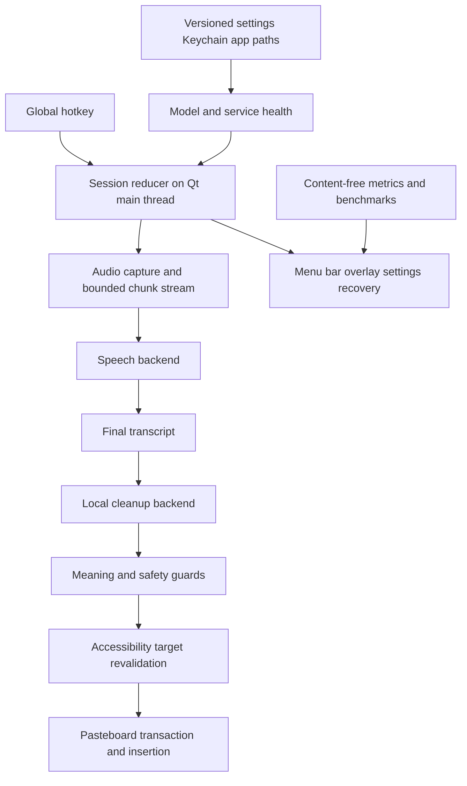

# Native macOS dictation product

## Goal Capsule

- **Objective:** Turn the verified macOS port into an instant-feeling, private, native menu-bar dictation product optimized for Apple Silicon while preserving the reliable batch stop-and-paste path.
- **Authority:** This plan and the confirmed scope govern product behavior. Existing repository instructions and verified macOS-port constraints govern implementation details. Current upstream library documentation governs packaging and MLX behavior where local assumptions differ.
- **Execution profile:** Reliability-first phased delivery. Characterize the current behavior, make sessions cancellable and deterministic, harden insertion and app-owned state, then add packaging, streaming, and personalization.
- **Stop conditions:** Stop rather than guessing if a required macOS entitlement cannot be made compatible with local model execution, if a proposed streaming backend regresses final transcript quality or increases stop-to-insert latency, or if implementation would overwrite the dirty macOS-port worktree.
- **Tail ownership:** The executor owns implementation, focused verification, visual inspection of the app surfaces, and preservation of the existing uncommitted port changes. No release publication or notarization submission is required without explicit signing credentials.

---

## Product Contract

### Summary

Build a signed-app-ready macOS menu-bar experience around the working local dictation pipeline, with deterministic sessions, safe insertion, app-owned models and settings, guided permissions, observable latency, optional streaming, and local personalization. The dependable batch path remains available at every stage.

### Problem Frame

The existing port proves the core loop on Apple Silicon: global hotkey, local microphone capture, MLX transcription, local LLM cleanup, and focus-checked paste. It is still operated as a Python project from a terminal, permissions attach to the launching terminal rather than a stable product identity, model and config paths are machine-specific, timeouts leave uncancelled work alive, focus safety identifies only the frontmost process, and there is no automated regression suite.

On this MacBook Pro with an M5 Max, 40-core GPU, and 128 GB unified memory, raw capacity is not the limiting factor. The product constraints are perceived latency, deterministic behavior, safe insertion into the intended field, meaning-preserving cleanup, durable permissions, and a low-friction daily experience.

### Actors

- A1. The primary user dictates into arbitrary native, browser, Electron, and terminal text fields.
- A2. The macOS product shell manages permissions, settings, models, lifecycle, health, and recovery.
- A3. Local speech and cleanup backends transform audio without cloud inference at dictation time.

### Requirements

**Reliability and latency**

- R1. Every dictation has an explicit session identity and legal state transitions owned by the Qt main thread.
- R2. Cancellation, timeout, quit, sleep, device loss, and stale async completions must never insert text from an obsolete session.
- R3. The app records p50 and p95 startup, transcription, cleanup, insertion, end-to-end latency, peak memory, and backend health without logging audio or transcript content by default.
- R4. The current batch transcription and cleanup path remains a supported fallback while streaming is evaluated and rolled out.
- R5. The default experience prioritizes stop-to-insert latency. An optional quality profile may use a larger model only when benchmark evidence justifies it.

**Native product experience**

- R6. The product ships as a stable-bundle-identifier macOS menu-bar app with app-owned paths and no dependency on the repository working directory.
- R7. First run explains and checks Microphone and Accessibility access, provides actionable recovery, and never reports ready while a required permission is absent.
- R8. Settings cover hotkey, input device, feedback, insertion behavior, cleanup mode, speed/quality profile, local vocabulary, privacy controls, and launch at login.
- R9. The menu-bar surface shows recording, processing, ready, degraded, and error states and offers retry, copy recovery, settings, diagnostics, and quit.
- R10. Startup shows the product shell promptly while models warm asynchronously with visible health.

**Insertion safety and recovery**

- R11. The app captures and revalidates the focused accessibility element, window, application, and pasteboard state before insertion, not only the process identifier.
- R12. A target change aborts automatic insertion and preserves the result in a local recovery surface or clipboard without losing the user’s words.
- R13. Clipboard restoration preserves available pasteboard types when practical and does not rely solely on a fixed sleep before restoration.
- R14. Automatic submit remains off by default. Recording-only Enter and Escape listeners are removed from the default path unless keystroke suppression can be made safe and explicit.

**Local models, privacy, and quality**

- R15. Models, settings, logs, vocabulary, optional history, and secrets use macOS-appropriate application support, cache, log, and Keychain locations.
- R16. The app owns cleanup-server readiness and fallback state so normal use does not require a separate terminal workflow.
- R17. Personal vocabulary, replacements, and per-app cleanup profiles remain local and are inspectable, editable, exportable, and deletable.
- R18. Optional history is off by default, encrypted or access-controlled using platform facilities, and has explicit retention and delete-all controls.
- R19. Cleanup evaluation protects names, numbers, URLs, code, paragraph intent, and speaker meaning while measuring filler removal and punctuation quality.
- R20. No cloud inference is introduced into the default or required runtime path.

### Key Flows

- F1. First launch and readiness
  - **Trigger:** A1 launches the app for the first time.
  - **Actors:** A1, A2.
  - **Steps:** Product shell appears; app explains and checks permissions; settings and model health are initialized; warmup runs asynchronously; readiness is shown.
  - **Outcome:** The user knows whether dictation is ready and how to resolve anything blocking it.
  - **Covered by:** R6-R10, R15-R16.
- F2. Successful instant dictation
  - **Trigger:** A1 presses the configured hotkey while the app is ready.
  - **Actors:** A1, A2, A3.
  - **Steps:** Target is captured; audio records; partial work may run when supported; stop finalizes transcription and cleanup; target is revalidated; text is inserted; metrics and recoverable result metadata are retained.
  - **Outcome:** Cleaned text appears in the intended field with low perceived latency.
  - **Covered by:** R1-R5, R11-R13, R19-R20.
- F3. Cancellation or stale result
  - **Trigger:** The user cancels, starts a newer session, quits, changes devices, or processing exceeds its deadline.
  - **Actors:** A1, A2, A3.
  - **Steps:** The active session is invalidated; pending work receives cancellation; late results are ignored; no insertion occurs; the UI returns to an accurate state.
  - **Outcome:** Obsolete content cannot leak into a field.
  - **Covered by:** R1-R4.
- F4. Focus changes during processing
  - **Trigger:** A1 moves to another field, tab, window, application, or Space after recording stops.
  - **Actors:** A1, A2.
  - **Steps:** Accessibility target revalidation fails; automatic paste is skipped; cleaned text is placed in recovery; the user can intentionally copy or paste it.
  - **Outcome:** Dictation is preserved without inserting into an unintended target.
  - **Covered by:** R11-R14.
- F5. Local backend degradation
  - **Trigger:** A preferred model or cleanup server is unavailable or becomes unhealthy.
  - **Actors:** A1, A2, A3.
  - **Steps:** Health changes to degraded; supported local fallback is selected; latency impact is shown; failed work remains recoverable.
  - **Outcome:** The product remains useful and explains the tradeoff without cloud fallback.
  - **Covered by:** R4-R5, R9-R10, R16, R20.

### Acceptance Examples

- AE1. Given a timed-out session whose worker finishes later, when a new session is already active, then the old result is discarded and cannot alter state, clipboard, or focused field.
- AE2. Given two focused fields in the same application process, when focus moves between them during processing, then automatic insertion aborts and recovery retains the cleaned text.
- AE3. Given existing rich or image clipboard content, when dictation inserts plain text, then the previous pasteboard contents are restored without corrupting the target paste.
- AE4. Given a clean installation, when the user grants permissions and relaunches or upgrades the same signed bundle identity, then the product reports the correct permission state and normal dictation works without terminal permissions.
- AE5. Given the preferred cleanup service is unavailable, when a dictation completes, then an allowed local fallback runs or the raw transcript is recoverable with a visible degraded state.
- AE6. Given a cleanup result that changes a protected number, URL, code token, or proper name, when the evaluation corpus runs, then the regression is reported and blocks release qualification.
- AE7. Given optional history is disabled, when dictation completes, then no transcript or cleaned text is persisted after recovery lifetime expires.

### Success Criteria

- A measured baseline and repeatable benchmark suite exists for short, medium, and long utterances.
- No state transition or insertion occurs from a stale or cancelled session in automated tests.
- The app launches promptly to a responsive menu-bar state while backend warmup continues separately.
- First-run permissions, settings persistence, launch at login, offline installed-model startup, and upgrade persistence are verified from a clean macOS user account or documented test fixture.
- The insertion matrix passes in TextEdit, Notes, Mail or another native rich-text app, Chrome or Safari contenteditable, Slack or another Electron app, VS Code, and Terminal.
- The final app can be bundled locally with a stable identifier and correct usage descriptions. Signing and notarization are configuration-ready even when credentials are unavailable.
- Performance budgets are derived from the baseline and enforced as regression thresholds rather than guessed in advance.

### Scope Boundaries

#### Included

- macOS Apple Silicon only.
- Python 3.11, PySide6, MLX, and the existing local cleanup-provider family unless a bounded spike proves a replacement is necessary.
- Native macOS adapters where permissions, Accessibility, pasteboard fidelity, Keychain, app paths, or login items require them.
- A local-only evaluation corpus made from synthetic or explicitly approved samples.

#### Deferred to Follow-Up Work

- Cloud synchronization of settings, vocabulary, or history.
- iPhone, iPad, Windows, Linux, and Intel Mac clients.
- Team administration, shared dictionaries, and organization policy controls.
- Broad multilingual optimization beyond preserving a backend interface that can support it.

#### Outside This Product’s Identity

- Required cloud inference or silent cloud fallback.
- Automatic submission of messages by default.
- Adaptive personalization that cannot be inspected, edited, or deleted by the user.
- Always-on ambient recording.

### Dependencies

- Current verified macOS-port worktree and `MACOS_PORT_HANDOFF.md`.
- PySide6 6.10.3 and a packaging path that produces a real `.app` with `Info.plist` permission descriptions.
- MLX-compatible speech model runtime on Apple Silicon.
- macOS Accessibility, pasteboard, Keychain, application-support, and login-item facilities.

### Outstanding Questions

- **Deferred:** Select the production signing team, certificate, and notarization credentials when a distributable build is requested.
- **Deferred:** Decide whether optional history should be included in the first public build after the no-history core is stable.
- **Deferred:** Select the best streaming recognizer only after the benchmark spike compares supported backends on this machine.

---

## Planning Contract

### Key Technical Decisions

- KTD1. **Make session identity the concurrency boundary.** Each async operation carries an immutable monotonically increasing session ID and cancellation signal. Only main-thread events for the active session may transition state or insert text. This fixes the current timeout threads that continue after the controller returns to idle.
- KTD2. **Separate product shell, pipeline, and platform adapters.** The Qt shell consumes typed state and outcomes; speech and cleanup implement backend protocols; macOS permissions, Accessibility, pasteboard, paths, Keychain, and login behavior live behind explicit adapters. This allows native correctness without rewriting the proven model pipeline.
- KTD3. **Benchmark before streaming.** First instrument the current batch path and build deterministic test seams. A streaming spike must demonstrate stable partials, bounded memory, final-quality parity, and lower perceived or stop-to-final latency before it becomes default. Batch remains selectable.
- KTD4. **Stream speech before cleanup.** Partial speech can improve feedback and finalization latency. Cleanup runs against a stable final transcript by default because cleaning unstable partials creates visible rewriting, added model load, and meaning risk.
- KTD5. **Use app-owned locations and typed versioned settings.** Bundled defaults merge with validated atomic user overrides under Application Support. Models live under Caches or Application Support according to durability, logs under Logs, and secrets in Keychain. Machine-specific repository paths are migration inputs only.
- KTD6. **Keep PySide6 for the first native product shell.** Current official Qt for Python guidance supports creating an app bundle with permission usage descriptions through `pyside6-deploy`. A bounded packaging spike must prove MLX/native-library inclusion before deeper shell polish. A Swift wrapper is a fallback only if packaging or TCC behavior cannot meet the contract.
- KTD7. **Treat Accessibility element identity as sensitive capability.** Capture enough target metadata to prevent cross-field insertion while avoiding persisted field contents. Revalidate immediately before paste and again before any optional follow-up key action.
- KTD8. **Own the warm cleanup lifecycle.** A health manager starts or connects to the configured local service, waits for readiness, stores secrets through Keychain, exposes degraded state, and shuts down only processes it owns. Direct CLI remains recovery, not the preferred latency path.
- KTD9. **Make evaluation a release gate.** Synthetic and approved audio/text fixtures test transcription latency, cleanup preservation, injection resistance, fallback, and insertion safety. Model changes are experiments against the corpus, not configuration guesses.
- KTD10. **Default to minimal retention.** Metrics are content-free. Recovery text is ephemeral. Vocabulary and optional history are explicit local features with independent deletion and export behavior.

### Architecture

### Sequencing

1. Freeze a behavioral baseline with test seams and metrics.
2. Fix concurrency, cancellation, typed outcomes, and main-thread state ownership.
3. Harden macOS focus, pasteboard, permissions, and recovery.
4. Move configuration, models, logs, secrets, and health into app-owned lifecycle.
5. Prove the bundle, stable identity, onboarding, settings, and launch-at-login path.
6. Measure and integrate streaming only when it clears the benchmark gate.
7. Add local vocabulary, profiles, and optional history after privacy controls exist.

### Risks and Mitigations

- **MLX packaging risk:** Native libraries and model discovery may behave differently inside an app bundle. Mitigate with an early arm64 packaging smoke test and app-relative resource resolution before UI expansion.
- **TCC permission instability:** Unsigned or frequently changing bundle identities can invalidate consent. Mitigate with one stable bundle ID and verify permissions across rebuild and upgrade fixtures.
- **False confidence in PID checks:** Same-process field changes are currently invisible. Mitigate with Accessibility element identity and a multi-field test matrix.
- **Streaming quality regression:** Rolling windows can duplicate, omit, or revise words. Mitigate with deterministic chunk fixtures, stable-prefix rules, final batch reconciliation, and a kill switch.
- **Clipboard corruption:** Text-only restoration can destroy rich data and early restoration can race target apps. Mitigate with pasteboard snapshots, change counts, adaptive completion, and recovery tests.
- **Personalization privacy:** Learned data can become an undeclared transcript store. Mitigate with explicit schemas, disabled-by-default history, retention controls, and delete-all verification.
- **Dirty worktree integration:** The port is uncommitted. Mitigate by recording the baseline diff, staging only newly planned paths, and never resetting or rewriting unrelated modifications.

### External Research Applied

- Current Qt for Python documentation indicates macOS permission APIs require a real app bundle with an `Info.plist`; `pyside6-deploy` supports macOS permission usage descriptions and is the primary packaging candidate.
- Current MLX documentation confirms unified memory, explicit CPU/GPU streams, lazy evaluation, and configurable memory and wired-memory limits. These are experimental tuning controls, not defaults, until benchmarks demonstrate a gain.
- No `docs/solutions/` learning library exists in this repository. Verified lessons were taken from the handoff and review log.

---

## Implementation Units

### U1. Characterize the verified baseline

- **Goal:** Add deterministic test seams and content-free performance instrumentation before behavior changes.
- **Files:** Modify `pyproject.toml`, `whisperflow_local/app.py`, `whisperflow_local/applog.py`, and `whisperflow_local/__main__.py`; create `whisperflow_local/metrics.py`, `tests/conftest.py`, `tests/test_audio.py`, `tests/test_cleanup.py`, `tests/test_inserter.py`, `tests/test_pipeline_baseline.py`, and `benchmarks/README.md` plus benchmark fixtures or runner.
- **Patterns to follow:** Keep PortAudio callbacks non-blocking; preserve the existing TextEdit selftest as an opt-in E2E rather than turning it into a default unit test.
- **Approach:** Introduce injectable backends and a clock at current seams without changing user-visible behavior. Capture stage durations, outcomes, cold/warm state, and memory without transcript content. Establish baseline profiles for representative short, medium, and long samples.
- **Execution note:** Characterize current behavior before refactoring. Preserve observed passing behavior and record intentional defects as failing tests for later units.
- **Test scenarios:** Empty and low-RMS audio; successful batch pipeline; cleanup fallback; content-free metrics; disabled transcript logging; short/medium/long benchmark inputs; current focus-change abort; current clipboard restoration.
- **Verification:** Unit suite passes; baseline benchmark produces structured local output; existing selftest remains callable and unchanged in intent.
- **Covers:** R3-R5, R19-R20; F2, F5; AE5-AE6.

### U2. Introduce deterministic cancellable sessions

- **Goal:** Replace implicit cross-thread state mutation with a typed main-thread session reducer and stale-result protection.
- **Files:** Create `whisperflow_local/session.py`, `whisperflow_local/pipeline.py`, and `whisperflow_local/errors.py`; modify `whisperflow_local/app.py`, `whisperflow_local/audio.py`, `whisperflow_local/overlay.py`, and `whisperflow_local/tray.py`; create `tests/test_session.py`, `tests/test_pipeline.py`, and `tests/test_controller.py`.
- **Patterns to follow:** Continue using Qt signals to marshal worker results. Keep audio callback work bounded and keep the batch backend contract available.
- **Approach:** Model starting, recording, finalizing, transcribing, cleaning, inserting, ready, cancelled, and error states with typed events. Carry session IDs and cancellation through all stages. Convert timeout, silence, provider failure, target change, and insertion failure into distinct outcomes. Make startup and model warmup asynchronous.
- **Execution note:** Start from failing proofs for timeout overlap, stale completion, start failure rollback, and worker-thread state mutation.
- **Test scenarios:** Legal and illegal transitions; double hotkey; microphone start failure; cancel during every stage; timeout followed by late completion; new session supersedes old session; quit during processing; overflow finalization; sleep or device loss event; failure status and recovery payload.
- **Verification:** No worker directly mutates product state; stale session events cannot insert; the shell becomes responsive before warmup completes; focused tests and full unit suite pass.
- **Covers:** R1-R5, R9-R10; F2-F5; AE1, AE5.

### U3. Build safe macOS platform adapters

- **Goal:** Make permissions, focus identity, pasteboard transactions, and recovery correct across real macOS applications.
- **Files:** Create `whisperflow_local/platform/__init__.py`, `whisperflow_local/platform/macos/accessibility.py`, `whisperflow_local/platform/macos/pasteboard.py`, `whisperflow_local/platform/macos/permissions.py`, and `whisperflow_local/recovery.py`; modify `whisperflow_local/inserter.py`, `whisperflow_local/clipboard.py`, `whisperflow_local/app.py`, and `whisperflow_local/__main__.py`; create `tests/test_accessibility.py`, `tests/test_pasteboard.py`, `tests/test_permissions.py`, `tests/test_recovery.py`, and extend `tests/test_inserter.py`.
- **Patterns to follow:** Fail closed on target mismatch. Preserve user text through recovery even when automatic insertion is unsafe. Keep automatic submission disabled.
- **Approach:** Capture frontmost app, window, and focused Accessibility element identity without persisting field contents. Revalidate at the final insertion boundary. Snapshot pasteboard items and change count, perform paste, restore only after consumption is observed or a bounded conservative delay, and retain a recovery copy on ambiguity. Replace default global Enter/Escape completion with the configured toggle hotkey.
- **Execution note:** Characterize TextEdit behavior, then add fakes for every boundary before using native APIs in integration tests.
- **Test scenarios:** Same process and different field; same app and different window; app switch; secure text field; target destruction; pasteboard with text, RTF, image, and multiple items; slow paste consumer; external clipboard mutation during insertion; Accessibility absent or revoked; recovery copy and retry.
- **Verification:** Unit suite passes; TextEdit E2E passes; manual insertion matrix is documented and completed for representative native, browser, Electron, editor, and terminal targets.
- **Covers:** R7, R11-R14; F1-F4; AE2-AE4.

### U4. Move settings, models, secrets, and health into the app lifecycle

- **Goal:** Remove repository and terminal dependencies from normal operation.
- **Files:** Create `whisperflow_local/paths.py`, `whisperflow_local/settings.py`, `whisperflow_local/keychain.py`, `whisperflow_local/model_manager.py`, and `whisperflow_local/health.py`; modify `whisperflow_local/config.py`, `whisperflow_local/cleanup.py`, `whisperflow_local/stt.py`, `whisperflow_local/autostart.py`, `whisperflow_local/applog.py`, `config.yaml`, and `whisperflow_local/__main__.py`; create `tests/test_paths.py`, `tests/test_settings.py`, `tests/test_keychain.py`, `tests/test_model_manager.py`, and `tests/test_health.py`.
- **Patterns to follow:** Keep the Python interpreter boundary between the app and Unsloth Studio. Keep OpenAI-compatible localhost HTTP as preferred cleanup with direct CLI only as degraded fallback.
- **Approach:** Define a versioned validated settings schema with bundled defaults, atomic user overrides, and migration from the existing YAML. Resolve models by stable cache identity rather than snapshot hashes or cwd. Store local service credentials in Keychain. Add service ownership, readiness, warmup, fallback, disk-space, download, and error states.
- **Execution note:** Use proof-first tests for malformed config, atomic write failure, stale snapshot paths, missing Keychain entry, server crash, and fallback recovery.
- **Test scenarios:** First run; config migration; invalid type/range; paths containing spaces; moved app; missing and partial model; disk full; download cancellation/resume where supported; service already running; owned service lifecycle; unowned service preserved; key rotation; offline installed-model launch; sleep/wake health recovery.
- **Verification:** No normal runtime path depends on repo cwd, hard-coded home path, or shell-exported secret; doctor reports actionable typed health; unit and integration tests pass.
- **Covers:** R6, R8-R10, R15-R16, R20; F1, F5; AE4-AE5.

### U5. Package the native menu-bar product shell

- **Goal:** Produce a locally installable app bundle with stable identity, guided onboarding, settings, diagnostics, and launch-at-login integration.
- **Files:** Create deployment configuration and resources under `packaging/`, plus `whisperflow_local/onboarding.py`, `whisperflow_local/settings_window.py`, and `whisperflow_local/diagnostics.py`; modify `whisperflow_local/__main__.py`, `whisperflow_local/tray.py`, `whisperflow_local/overlay.py`, `whisperflow_local/autostart.py`, and `pyproject.toml`; create `tests/test_onboarding.py`, `tests/test_diagnostics.py`, and packaging smoke scripts or tests under `tests/packaging/`.
- **Patterns to follow:** Use the verified PySide6 shell and official `pyside6-deploy` bundle flow first. Include microphone usage descriptions and Accessibility guidance in the bundle. Preserve a non-activating overlay and menu-bar-first app behavior.
- **Approach:** Run an early arm64 bundle spike, then add a stable bundle ID, icon assets, app metadata, first-run onboarding, settings window, menu health/recovery, launch-at-login abstraction, diagnostics export with content redaction, and signing/notarization configuration placeholders.
- **Execution note:** Packaging is a smoke-first surface. Prove bundle launch, model imports, resources, and permissions before polishing screens.
- **Test scenarios:** Clean install; first launch with neither permission; one permission missing; permission revocation; relaunch and upgrade persistence; app relocation; offline startup; launch at login; menu bar only; overlay across Spaces and full-screen; missing model; degraded cleanup; diagnostics redaction; unsigned local bundle and signing-config validation.
- **Verification:** A local `.app` launches outside the repo, presents correct permission usage descriptions, finds installed models and settings, and passes the smoke matrix. Signing/notarization steps are documented but not executed without credentials.
- **Covers:** R6-R10, R15-R16; F1, F5; AE4-AE5.

### U6. Add benchmark-gated streaming and performance profiles

- **Goal:** Make dictation feel faster using partial speech processing and measured Apple Silicon tuning without sacrificing final correctness.
- **Files:** Create `whisperflow_local/backends/base.py`, `whisperflow_local/backends/speech_batch.py`, `whisperflow_local/streaming.py`, and profile definitions; modify `whisperflow_local/audio.py`, `whisperflow_local/stt.py`, `whisperflow_local/pipeline.py`, `whisperflow_local/metrics.py`, `whisperflow_local/settings.py`, and `whisperflow_local/overlay.py`; create `tests/test_streaming.py`, `tests/test_backpressure.py`, `tests/test_profiles.py`, and benchmark comparisons.
- **Patterns to follow:** Use a bounded ring or chunk queue from audio capture; do not block or perform inference in the PortAudio callback; reconcile against a final authoritative transcript; keep batch selectable.
- **Approach:** Spike supported MLX speech candidates and rolling-window behavior on this M5 Max. Define stable-prefix, overlap, deduplication, backpressure, cancellation, and final reconciliation semantics. Add Instant and Quality profiles only when benchmark evidence supports their model and batch choices. Treat MLX memory limits, wired memory, streams, and compilation as measured tuning experiments.
- **Execution note:** Do not assume the current backend supports correct streaming. Land the protocol and benchmark first; enable streaming only behind a feature flag until it clears gates.
- **Test scenarios:** Ordered chunks; duplicate overlap; revised partial; dropped or late chunk; queue pressure; silence; five-minute cap; cancellation; model reload; sleep/wake; batch fallback; final transcript parity; peak memory and thermal behavior; content-free latency telemetry.
- **Verification:** Streaming default is enabled only if it beats the batch baseline on the defined latency budget, stays within memory/energy bounds, and passes final-quality invariants. Otherwise the spike remains optional and batch ships.
- **Covers:** R2-R5, R10, R19-R20; F2-F3, F5; AE1, AE6.

### U7. Add local writing modes, vocabulary, and privacy controls

- **Goal:** Improve daily usefulness through inspectable local adaptation without turning the product into an undeclared transcript archive.
- **Files:** Create `whisperflow_local/vocabulary.py`, `whisperflow_local/profiles.py`, `whisperflow_local/history.py`, and `whisperflow_local/evaluation.py`; modify `whisperflow_local/cleanup.py`, `whisperflow_local/settings.py`, `whisperflow_local/settings_window.py`, `whisperflow_local/recovery.py`, and `config.yaml`; create `tests/test_vocabulary.py`, `tests/test_profiles.py`, `tests/test_history.py`, `tests/test_evaluation.py`, and evaluation fixtures under `tests/fixtures/evaluation/`.
- **Patterns to follow:** Keep cleanup prompt injection guards and meaning-preserving fallback. Store only explicit local user data. Make history independently disabled and deletable.
- **Approach:** Add named cleanup modes, per-app selection, vocabulary and deterministic replacements, protected-token checks, corpus evaluation, and optional bounded local history with retention, export, delete-one, and delete-all. Recovery remains ephemeral when history is disabled.
- **Execution note:** Write privacy and deletion tests before persistence. Use synthetic fixtures unless the user explicitly approves real samples.
- **Test scenarios:** Proper names; numbers; dates; URLs; file paths; code; commands; paragraphs; false starts; embedded instructions; mode switching; per-app override; vocabulary collision; import/export; history disabled; retention expiry; delete-one; delete-all; corrupted local store; diagnostics and logs never include content by default.
- **Verification:** Evaluation corpus reports preservation and cleanup metrics; all local data is inspectable and deletable; disabled history leaves no persistent transcript content; full suite passes.
- **Covers:** R8, R15, R17-R20; F2, F4; AE6-AE7.

---

## Verification Contract

| Gate | Command or method | Applies to | Done signal |
|---|---|---|---|
| Static compile | `PYTHONPYCACHEPREFIX=/tmp/whisperflow-pycache .venv/bin/python -m compileall whisperflow_local tests` | U1-U7 | No syntax or import compilation failures |
| Unit and integration tests | `.venv/bin/python -m pytest -q` | U1-U7 | All non-GUI automated tests pass |
| Diff hygiene | `git diff --check` | U1-U7 | No whitespace errors |
| Environment health | `.venv/bin/python -m whisperflow_local doctor` | U4-U7 | Required services and permissions accurately reported; degraded fallback is explicit |
| Existing end-to-end proof | `.venv/bin/python -m whisperflow_local selftest` | U1-U7 | Sample transcribes, cleans, and inserts into TextEdit |
| Performance benchmark | Project benchmark runner documented under `benchmarks/README.md` | U1, U6 | Baseline and candidate results include p50/p95 stage latency, peak memory, and cold/warm distinction |
| App bundle smoke | Launch the built `.app` outside the repo with a clean app-support directory | U5-U7 | Menu appears, resources resolve, permissions are actionable, installed models run offline |
| Real-app insertion matrix | Manual checklist covering native, browser, Electron, editor, and terminal targets | U3, U5-U7 | Intended target receives text; changed target aborts; clipboard and recovery behave correctly |
| Privacy audit | Automated persistence/log scan plus settings delete-all flow | U4, U7 | No content persistence when disabled; export and deletion semantics verified |

---

## Definition of Done

- R1-R20 are implemented or explicitly deferred in a follow-up artifact without weakening the confirmed product scope.
- All acceptance examples pass through automated tests or documented macOS manual verification where system permissions or third-party applications prevent deterministic automation.
- The app’s main thread exclusively owns visible state transitions, and stale workers cannot insert or mutate the active session.
- Normal use requires no repository cwd, terminal-managed environment variable, or separately started cleanup command.
- The locally built `.app` has a stable bundle identifier, correct permission descriptions, app-owned storage, actionable onboarding, settings, health, recovery, and launch-at-login behavior.
- Batch dictation remains reliable. Streaming is default only if its benchmark and quality gates pass on this machine.
- The evaluation corpus protects meaning, names, numbers, URLs, code, and paragraph intent while measuring cleanup value.
- Transcript content is not logged, persisted, or included in diagnostics by default. Optional retained data is inspectable, exportable, and deletable.
- Unit, integration, selftest, benchmark, packaging smoke, insertion matrix, and privacy gates are green or carry a concrete environment-only limitation documented in the final handoff.
- Existing macOS-port worktree changes are preserved; no unrelated user change is reset, overwritten, or silently committed.
